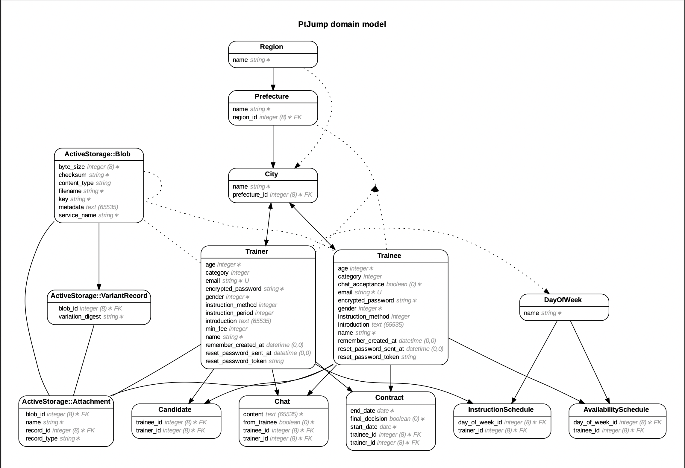

# **P.T.Jump**

**トレーナー**（トレーニング指導者）と**トレーニー**（トレーニング指導を受ける人）がマッチングするためのwebアプリケーションです。

 

 

これからトレーニングを始める初心者**トレーニー**が、簡単に理想のトレーナーを見つけることができます。  
また、指導経験が十分にないトレーナーに自ら交渉することで、低額の料金でトレーニング指導を依頼することも可能となります。パーソナルトレーニングの敷居を下げ、身近なサービスにします。

一方で、顧客の獲得に課題を抱えている**トレーナー**に活躍の場を提供します。  
特にフリーランスのトレーナーにとって、指導の経験を増やし、実績を得るためのプラットフォームとなります。  
※（**以降、トレーナーと表記した場合はフリーランスのトレーナーを指します。**）

フィードバックがあれば積極的にアプリケーションに反映します。  
また、様々な機能を実装したいと考えています。利便性を高めるため、このアプリケーションはこれからも成長し続けます。

### **WEBサイトのURL**
***
[P.T.Jump](https://limitless-basin-78126.herokuapp.com/) (←こちらをクリックして、公開中のwebサイトをご覧ください。)

※動作確認をする場合は、  
以下のユーザーの**ログイン情報**をご利用ください。

#### **トレーニー**
* Eメール：trainee2@example.com
* パスワード：password2

 

#### **トレーニー**
* Eメール：trainer2@example.com
* パスワード：password2

 

## **目次**
  - [**開発した目的**](#開発した目的)
  - [**使い方**](#使い方)
  - [**使用技術**](#使用技術)
  - [**システム構成**](#システム構成)
  - [**機能一覧**](#機能一覧)
  - [**テスト**](#テスト)
  - [**リンター**](#リンター)
  - [**デプロイ**](#デプロイ)
  - [**こだわったポイント**](#こだわったポイント)
  - [**今後の拡張機能予定**](#今後の拡張機能予定)

 

## **開発した目的**

### **初心者トレーニーの挫折を防ぐためにはパーソナルトレーニングが有効**

 

トレーニング初心者は、なかなか自分の理想の体にならないことで挫折してしまいやすいです。  
トレーニングに関する知識もなく、憶測や偏見でトレーニングや食事の内容を決めてしまうことが根本的な原因です。

自己流ではなく効果的な方法を知るためにパーソナルトレーニングを利用するのは非常に有効的です。しかし、パーソナルトレーニングは敷居が高いものとなっています。

 

### **パーソナルトレーニングを受ける方法**

 

トレーニーがパーソナルトレーニングを受ける際、担当のトレーナーを見つける方法が主に２つあります。

 

***

* **１つ目はスポーツジムなどの施設でパーソナルトレーニングを申し込む方法です。**

 

#### **トレーニーの視点**
一般的な方法ですが、料金が高くなりやすいです。また、対応しているスタッフ・時間が限定的なので、トレーニーの思い通りにならない場合が多いです。しかしながら、その施設を経由して契約するため、安心感はあります。

 

#### **トレーナーの視点**
ターゲットとなる顧客が施設の会員に限定されますが、顧客の獲得はある程度安定します。  
しかし、資格を所有し、すでに指導実績のあるようなトレーナーでないと、宣伝するための媒体を施設に設置することを断られることがあります。

（※備考：トレーナーとしての資格は民間資格なので、実際には無資格でも指導できます。）

 

***

* **２つ目はSNSを利用してトレーニーを募集しているパーソナルトレーナーをSNS上で見つけて申し込む方法です。**

 

#### **トレーニーの視点**
この方法では一部の魅力的なトレーナーがすぐに目に留まります。しかし詳細を見ると、実績が十分にある有名なトレーナーは大抵の場合は非常に高額な料金設定となってます。

一方で、指導実績が少なく低額な料金で指導するトレーナーは、SNSで検索しても見つけにくいのです。見つけたとしても安心感は得にくいです。実際にそのトレーナーから指導を受けたトレーニーが書いたレビューを見つけられないからです。  
例えばTwitterを使ってトレーナーを見つける場合、そのトレーナーのハッシュタグやユーザーネームなどでツイートを検索し、レビューを探さないといけません。有名ではないトレーナーであれば、そもそもレビューをしているツイートがないかもしれません。

 

#### **トレーナーの視点**

指導経験のないトレーナーがSNSで宣伝することは非常に効果的です。

しかしながら、自分のファンが多くいる場合に限ります。「個人的に大会に出場するような選手である」「人気のあるYoutuberである」などといった優位性がなければ、顧客の獲得は困難です。低額の指導料金設定にしても、そもそもトレーニーの目に留まらないことが多く、広く普及しているSNSを用いた宣伝では宣伝効果がほとんど挙げられないかもしれません。

指導経験のないフリーランスのトレーナーは、パーソナルトレーナーとしてだけでは生活することは難しいと考えられます。

 

***

### **パーソナルトレーニングに関して、トレーニー・トレーナー共に課題を抱えている**

 

結果的に、トレーナーを見つける安定した方法は、どれも料金が高くなってしまいます。

 

**本来パーソナルトレーニングを受けるべきである初心者トレーニーにとって、手の出しにくいものになってしまっています。**

 

**新規参入したフリーランスのトレーナーにとって、集客方法に課題を抱えているケースが多くあります。**

 

**これらの問題を解決するべく、パーソナルトレーナーとトレーニーをマッチングさせることに適したWebアプリケーションが必要だと判断し、「P.T.Jump」を開発いたしました。**

 

***

### **このアプリケーションを開発する意義**

 

私はスポーツジムでアルバイトをしていました。主に会員のお客様（トレーニー）にトレーニングの指導を行う業務を担当していました。

また、自分自身がボディビル経験者ということもあり、同スポーツジム内で活動していたトレーナーの方々と会話をすることが多くありました。  
そこでフリーランスのトレーナーの様々な事情を知りました。

これらの経験から、**パーソナルトレーニングをより身近なサービスにすることは非常に有意義なこと**であると私は考えたのです。

私が伝えたいことは、  
「**初期費用がかかったとしても正しい方法を知ることで、時間も努力も無駄にせずに済む**」  
ということです。そのためにパーソナルトレーニングの在り方を変えたいと思いました。

トレーニングをこれから始める初心者が気軽にパーソナルトレーニングを利用できるようになれば、  
独自で考えついた方法よりも早く、かつ良い結果が出やすくなります。  
結果が出れば継続する意欲が出ます。  
更にその人の周りにいる人が、トレーニングをして変化したトレーニーの姿を見て自分もトレーニングを始めるかもしれません。  

このように、パーソナルトレーニングを気軽に利用できるようになることで、  
結果的にフィットネス人口が増え、ひいては健康的な人が増えるという良いサイクルを生むと考えられます。

 

このwebアプリケーションがフィットネス産業の一助となることを願っています。

 

## **使い方**

 

### **ユーザー検索**
***
様々な条件を用意したユーザー検索機能を利用して、理想のユーザーを探すことができます。

もちろんトレーナーがトレーニーを検索する事もできます。

 

### **トレーナー候補**
***
トレーニーとして利用している場合は、  
気になるトレーナーを見つけたら、トレーナー候補に加えましょう。

 

トレーナー候補に加えておくと、トレーナー候補の一覧ページで気になるトレーナーをいつでも参照することができます。

 

### **チャット**
***
魅力的なユーザーを見つけたら、是非チャット機能を利用して交渉してみましょう！

 

### **契約**
***
指導を受けることを決定したら、トレーニーは相手のトレーナーに契約リクエストしましょう。

 

契約成立前であれば契約リクエストを取り消すこともできます。

 

トレーナーはリクエストされた契約を確認した後にその契約を成立しましょう。

 

自分に関わる契約は、契約一覧ページでご確認いただけます。

 

### **レビュー**
***
（未実装です。実装予定です。）契約が成立した後、トレーニーは指導するトレーナーのレビューをすることができるようになります。

 

## **使用技術**

* Ruby  3.0.2

* Ruby on Rails  6.1.4

* Bootstrap 5.1.3 & jQuery

* MySQL  8.0

* Puma

* AWS： S3

* Docker / docker-compose

* RSpec

* Heroku

 

## **システム構成**

### **開発環境**
* Docker / docker-compose によって開発環境を構築

* overcommit gem によって、リンター/テストの実行忘れを予防  
※ git commitの前にrubocopを実行。  
※ git pushの前にrspecを実行

 

### **本番環境**

* Herokuによってデプロイ

* 本番環境のDBは、HerokuのアドオンであるJawsDB  
※ シードデータの生成時にクエリ数の上限を超えてしまうため、  
Leopard Sharedプランを利用しています。

 

### **ER図**

※rails-erd gemを使用してこちらのER図を作成しました。  
コマンド：` erd --attributes=foreign_keys,content`

 

## **機能一覧**

* 指導する側のユーザーをトレーナー  
指導を受ける側のユーザーをトレーニー  
としてユーザー種別を分けた。 (devise)

* ユーザー登録、ログイン機能 (devise)

* ユーザーのEメール・パスワード以外のデータをプロフィール情報として区別

* アバター画像(ActiveStorage)

* トレーニー・トレーナー検索機能

* チャット機能

* 契約機能

* トレーナー候補機能(Ajax)

 

## **テスト**

### **テストで使用した技術**
* **フレームワーク**
  * **RSpec**

+ **テスト用に使用したGem**
  * rspec-rails
  * factory_bot_rails
  * capybara
  * spring-commands-rspec

### **テストの内容**
* 単体テスト ( model spec )
* 機能テスト ( request spec )
* 統合テスト ( system spec )

 

### **テスト方法**

springのコマンドを使用することで比較的早くテストを実行することができます。

`bin/rspec`

ユーザーの活動地域についてのテストも実行するため、  
**テスト環境でシードデータを生成する必要があります。**

※(再生しているデータの詳細は[テスト用シードファイル](db/seeds/test.rb)を参照してください。)

テストでエラーが発生した場合、こちらのコマンドを実行してみてください。

1. `rails db:migrate:reset RAILS_ENV=test`
2. `rails db:seed RAILS_ENV=test`

また、overcommit gem によって、git push の実行前に自動でRSpecが実行されます。

 

 

## **リンター**

### **使用したGem**
* rubocop-airbnb

### **リンター使用方法**
`rubocop --require rubocop-airbnb`

また、overcommit gem によって、git commit の実行前に自動でRubocopが実行されます

 

## **デプロイ**

### **使用技術**
#### **Heroku**によるデプロイ

WEBサーバー：puma (Nginxに移行予定)

APサーバー：puma (Unicornに移行予定)

DB：JawsDB MySQL (Leopard Shared)  
※Herokuのアドオン。  

※JawsDB MySQLをグレードアップしている理由は、デフォルトのグレードではシードデータの生成ができないからです。  
アプリが用意しておくべき市区町村データなどをテーブルに保存する際に、クエリ数の上限を超えてエラーが発生してしまうため、グレードアップしています。

 

### **デプロイ方法**

`git push heroku <ブランチ名>:main`

※Circle CI をインフラに取り入れることで、push前のテストを実行する仕様に変更する予定です。

 

### **WEBサイトのURL（再掲）**
***
[P.T.Jump](https://limitless-basin-78126.herokuapp.com/) (←こちらをクリックして、公開中のwebサイトをご覧ください。)

※動作確認をする場合は、  
以下のユーザーの**ログイン情報**をご利用ください。

#### **トレーニー**
* Eメール：trainee2@example.com
* パスワード：password2

 

#### **トレーニー**
* Eメール：trainer2@example.com
* パスワード：password2

 

## **こだわったポイント**

### **ユーザーのデータ**
ユーザーが持つ情報は
* アカウント情報(メールアドレス・パスワード)
* プロフィール情報(名前や年齢、性別、カテゴリーなど)

の2つに区別し、データを変更するページも分けました。

アカウント情報の変更には、現在のパスワードの入力を必要とし、プロフィール情報の変更には現在のパスワードは不要としました。

前者はdeviseによる実装で、後者はカスタムコントローラによる実装です。

 

### **市区町村のデータ**
ユーザーの活動地域データを準備した行程を以下に記します。
1. 総務省のサイトのページ「 [都道府県コード及び市区町村コード](https://www.soumu.go.jp/denshijiti/code.html) 」のExcelファイルをcsvファイルに変換してダウンロード。

 

2. seedファイル内で先程のcsvファイルのデータを抽出して、都道府県・市区町村のデータをそれぞれprefecturesテーブル・citiesテーブルに保存。

 

3. 先程のcsvファイルに地方 ( 八地方区分 ) のデータを入れる行を追加し、地方区分データを用意。そしてseedファイルでregionsテーブルにデータを保存。  
 
※ 検索ページやプロフィール情報の変更ページ内で、全ての都道府県をページに表示すると、対象の都道府県を探すのが大変だったため。

行程 3 の結果、検索フォーム・プロフィール変更ページの視認性が向上しました。

 

### **活動できる曜日のデータ**
月曜日から日曜日までのデータが入っているテーブル（day_of_weeksテーブル）を作成し、各ユーザー種別のテーブルとの間に中間テーブルを設置しました。
* availability_schedulesテーブル（トレーニー用の中間テーブル）
* instruction_schedulesテーブル（トレーナー用の中間テーブル）

曜日以外のデータ（時間帯など）を必要とした場合、この中間テーブルに対象のデータベースの外部キーのカラムを追加することで、day_of_weeksテーブルと同じくユーザーに関連付けをすることが可能です。

 

### **契約データ**
トレーニーが契約リクエストを行い、トレーナーが契約成立を承認するシステムにすることで、片方のユーザーが一方的に契約できない仕組みにしました。

まだリクエスト段階なのか、すでに成立しているのかは、 「 **final_decision**カラム 」 によって実装しました。
* falseであれば、契約は成立しておらず、リクエスト中の契約と判断します。
* trueであれば、契約は成立済みであると判断します。

また、リクエスト段階の契約はトレーニーが削除できるようにしました。

 

### **チャット**
同じユーザー種別同士のチャットは不要と判断しました。  
そのため、URLに入力したidが、自分とは異なるユーザー種別のユーザーのidとなるよう実装しました。

送信者のユーザー種別を判断するのは 「 **from_trainee**カラム 」 です。
* trueであれば、トレーニーからの送信であると判断します。
* falseであれば、トレーナーからの送信であると判断します。

 

また、トレーナーからチャットを送信されることを嫌がるトレーニーユーザーがいることを想定して、チャットの許可をする機能を実装しました。traineesテーブルの 「 **chat_acceptance**カラム 」によって判断します。
* trueとなっている場合、トレーナーがチャットを送れるようにしました。
* falseとなっている場合、トレーナーがチャットを送れないようにしました。

しかし、既にトレーニーからのチャット送信があった場合、トレーナーはそのトレーニーとチャットすることが可能になるようにしました。

また、ユーズケースとしては考えにくいですが、トレーニーがトレーナーにチャットを一度も送信せずに契約リクエストをしている場合も同様に、トレーナーはトレーニーにチャットを送ることができるようにしました。

 

### **トレーナー候補**
トレーニーのみ利用可能となっている機能です。

トレーナーを比較したり、再度指導を申し込むためにトレーナーを参照するケースを想定し、  
気になるトレーンーユーザーのページをいつでも参照できるようにするために用意した機能です。

トレーナーが一覧で表示されるページ（検索ページ・トレーナー候補一覧ページ）と、トレーナーの詳細ページに 保存/削除 できるボタンを設置しました。Ajaxによる実装です。

 

## **今後の拡張機能予定**

* チャットページでActionCableを使用した非同期通信を実装する。

* 年齢を変更できなくする。ユーザーの新規登録時に生年月日を入力させて、年齢の計算をアプリが行う。計算結果をページに表示する。

* トレーナーの指導風景や、自身を紹介する画像・動画をアップロードする機能を追加する。  
ActiveStorageを使用する。  
詳細ページに閲覧のためのリンクを設置する。

* ユーザーのSNS連携を可能にする。

* トレーナーを評価する機能を追加する。  
レビュー文だけでなく、５段階の星評価も用意する。Ajaxで実装する。

* トレーニーが不特定多数のトレーナーに質問する機能を追加する。  
この機能により、トレーニーとマッチングするためのアプローチ方法が増える。

 

これら以外にも、利便性を高めるため、機能を追加・改良する予定です。

